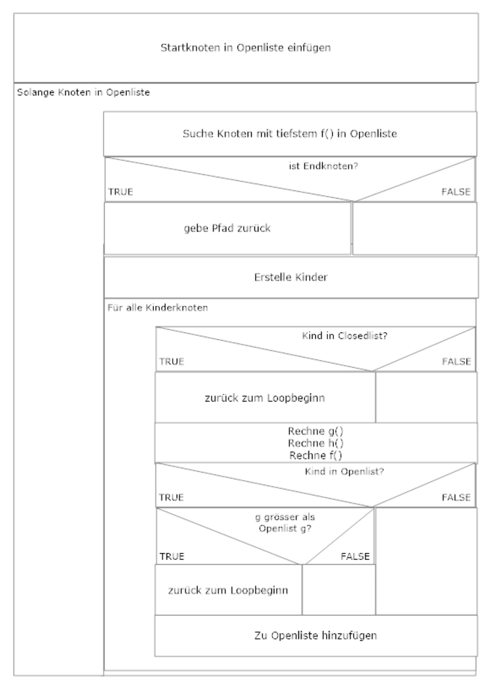

# astar_zenji_bachr2
A* (A Star) für Zenji

Zenji ist ein Zustandsraumproblem, auch bekannt aus dem C64-Game Zenji. Dies ist ein kleines Python-Projekt gemacht in PyCharmefür das Wahlfach AI an der BFH. Es implementiert einen A*-Algorithmus mit Heuristik für Zenji

Erstellt von Rico Bachmann (bachr2)

## Aufgabenstellung

Zenjiist ein Zustandsraumproblem, es besteht aus einer Reihe von quadratischen Feldern mit Röhren, die in einem (rechtwinkligen) Gitter angeordnet sind. Das linke obere Feld enthält eine Wasserquelle, das linke untere Feld ist ein Hahn. Die Röhren-Felder dürfen gedreht werden, jedoch nicht ersetzt oder verändert werden. Aufgabe ist es diese Röhrenquadrate so zu drehen, dass ein durchgängiger Wasserfluss von der Quelle (links oben) zum Hahn (rechts unten) möglich wird. Die Röhren haben zudem eine Eingangs-oder Ausgangsrichtung. Diese ist beim Wasserfluss zu beachten. In der Basisaufgabe wollen wir annehmen, dass das Wasser (aufgrund der Steigung) nur von links nach rechts und von oben nach unten fliessen kann. Die Basisaufgabe besteht nun darin ein Programm in Python oder Java zu schreiben, das dieses Puzzle löst. Dieses Programm muss die Codierung der Problemdomäne enthalten und einen Suchalgorithmus. Die Ausgabemuss nicht grafisch sein, sondern kann als Text auf das Protokollfenster oder in ein File erfolgen. Wir berechnen für das Drehen der Röhrenquadrate Kosten, und zwar sei nur die Drehung um 90 Grad in Uhrzeigerrichtung als Operation erlaubt. Jede Drehung kostet den Wert 1. Bestimmen Sie die kostengünstigste Lösung. Jetzt kann die iterierte Tiefensuche zum Einsatz kommen (IDS), IDA* oder A*. Für die ersten beiden Algorithmen kann die Tiefensuche zur Lösung der Basisaufgabe (entsprechend abgeändert) eingesetzt werden. Verwenden Sie von Heuristiken. Beispielsweise wird für IDA* und A* eine Heuristik benötigt, die die Distanz zum Ziel schätzt. Zudem kann man ggf. für bestimme Röhrenquadrate rasch überprüfen, ob der Weg fortgesetzt werden kann.

## Karte und Weg

Beispiel des Koordinatensystems der Karte:

| n x m  | 0 | 1  | 2 | 3 |
| --- | --- | --- | --- | --- |
| 0  | 0, 0  | 0, 1  | 0, 2  | 0, 3  |
| 1  | 1, 0  | 1, 1  | 1, 2  | 1, 3  |
| 2  | 2, 0  | 2, 1  | 2, 2  | 2, 3  |
| 3  | 3, 0  | 3, 1  | 3, 2  | 3, 3  |

Eine Karte besteht aus einem, auf n-mal-m Feldern (n x m == Reihen x Kolonen) ausgelegten, Röhrensystem. Jedes der Felder (ausser Start und Endpunkt) können im Uhrzeigersinn gedreht werden.

Die Beispielkarte ausdem Projekt (Definition der Tür (N, O, S, W): Blockade (0), Eingang (1), Ausgang (2), Quelle (3), Ablauf (4)):

| n x m  | 0 | 1  | 2 | 3 |
| --- | --- | --- | --- | --- |
| 0  | 3, 2, 2, 3 | 2, 0, 1, 0 | 1, 2, 2, 1 | 0, 0, 0, 0 |
| 1  | 0, 0, 0, 0 | 0, 0, 1, 2 | 0, 1, 2, 2 | 0, 0, 2, 1 |
| 2  | 0, 0, 2, 1 | 1, 0, 2, 0 | 1, 2, 1, 2 | 0, 1, 0, 2 |
| 3  | 1, 2, 0, 0 | 1, 2, 0, 1 | 1, 2, 0, 0 | 1, 4, 4, 1 |

### Feld

Beispiel eines Feldes welches in Position 0 im Norden und im Osten eine Blockade hat, im Süden einen Ausgang und im Westen einen Eingang

| w | n s | e |
| --- | --- | --- |
|     |  0  |     |
|  1  |     |  0  |
|     |  2  |     |

Ein Feld besteht aus einem Teil des Röhrensystem, jede Seite des Feldes ist entweder ein Eingang (1), Ausgang (2) oder eine Blockade (0). Im Spiel sind zusätzlich noch die Wasserquelle (3) und der Wasserablauf (4) definiert. Unser Beispielfeld würde mit folgenden Arraywerten erstellt: [0, 0, 2, 1] Um das Feld zu rotieren, müssen nur die Positionen im Array geschoben werden

## A*

Der A* Algorithmus erklärt mit einem vereinfachten Struktogramm

### Speziell für Zenji

#### Generierung Kinderknoten

Um alle Kinderknoten zu generieren überprüfen wir die Nachbar-Quadrate, welche in allen Himmelsrichtungen anliegen. Anhand der Richtung können die Koordinaten des neuen Nodes berechnet werden. Norden = (-1, 0), Osten = (0, 1), Süden = (1, 0) und Westen (0, -1). Jetzt wird gecheckt, ob die neuen Koordinaten in unserem Spielfeld liegen, falls nicht, wird der Kind-Knoten ignoriert. Als nächstes wird überprüft, ob unser Knoten einen Ausgang in dieser Himmelsrichtung zur Verfügung hat. Trifft dies zu so wird der Kind-Knoten provisorisch erstellt. Jetzt werden alle Rotationspositionen des Kind-Knotens auf Eingänge überprüft. Wir merken uns alle Positionen mit Eingängen. Für jede gefundene Eingangsposition wird ein Kind-Knoten erstellt. Diese Kind-Knoten werden jetzt weiterverarbeitet.

#### Heuristik und Wegkosten (f() = g() + h())

f() stellt den Kostenwert unseres Nodes in der aktuellen Rotationsposition dar. f() kann ganz einfach aus den Teilresultaten von g() und h() berechnet werden.

f() = g() + h()

g() ist die Funktion zum Berechnen der bisherigen Wegkosten. Die Wegkosten des Elternknoten, plus eins für den Weg + die Rotation des Elternknotens sowie die Eigenrotation. Die Summe dieser Werte ergibt unsere bisherigen Wegkosten.

g() = Eltern.g + 1 + Eltern.rot + Kind.rot 

h() stellt unsere Heuristik Funktion dar. Die Heuristik Funktion gibt uns einen ungefähren Wert für die noch offene Strecke zurück. Da in Zenji nicht Diagonal gefahren werden kann, können wir einen einfachen Richtwert erhalten indem wir die Differenzen von unseren X-und Y-Koordinaten und den Endkoordinaten rechnen und diese addieren. Da jetzt bisher noch mögliche Drehungen ignoriert wurden, wird der Wert verdoppelt.

h() = 2 * (( Ziel.x - Kind.x ) + ( Ziel.y - Kind.y ))

## Quellen

[easy-a-star-pathfinding](https://medium.com/@nicholas.w.swift/easy-a-star-pathfinding-7e6689c7f7b2), Beispiel für A* an
einem einfachen Irrgartenspiel
